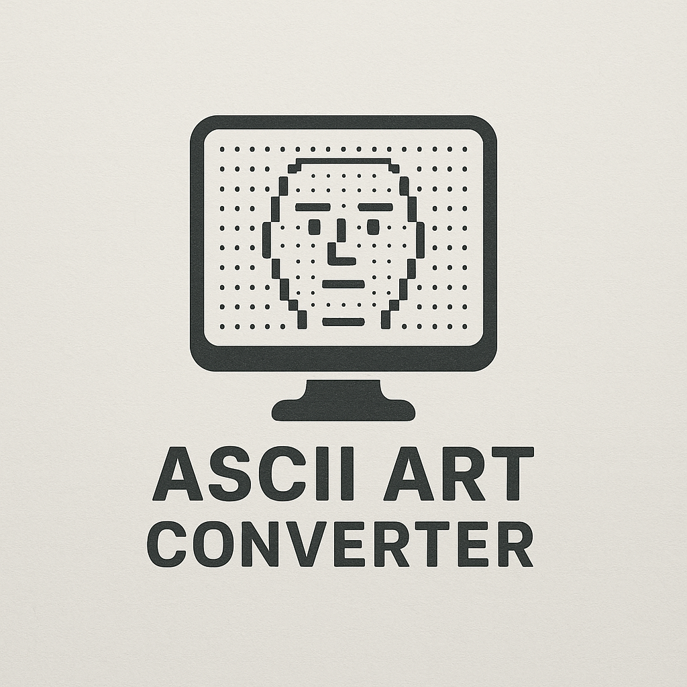

# ASCII Art Converter

A lightweight, browser-based tool for converting images to ASCII art using HTML, CSS, and JavaScript.

## Features

- **100% Client-Side Processing**: No server required, all conversion happens in your browser
- **Customizable Output**:
  - Adjust output width (number of characters)
  - Control brightness and contrast
  - Choose between standard or inverted color modes
  - Select from multiple character sets or define your own
- **Responsive Design**: Works on desktop and mobile devices
- **One-Click Copy**: Easily copy the generated ASCII art to clipboard
- **No Dependencies**: Pure vanilla JavaScript with no external libraries

## Live Demo

[View Live Demo](https://taher-el-mehdi.github.io/image-2-ascii/)

## How to Use

1. Open the tool in your web browser
2. Click "Upload Image" to select an image from your device
3. Use the controls to adjust the output settings:
   - **Width**: Determines how many characters wide the ASCII art will be
   - **Contrast/Brightness**: Adjust image appearance before conversion
   - **Color Mode**: Choose between standard (dark characters on light) or inverted
   - **Character Set**: Select from predefined sets or enter custom characters
4. Click "Process Image" to generate the ASCII art
5. Use the "Copy ASCII Art" button to copy the result to your clipboard

## How It Works

The ASCII Art Converter works by:

1. Loading your image into a hidden HTML canvas
2. Resizing it to the desired character width while maintaining aspect ratio
3. Reading the grayscale value of each pixel
4. Mapping each pixel's brightness to a character from the selected character set
5. Assembling these characters into rows and columns to form the final ASCII art

## Technical Details

- **Image Processing**: Uses the HTML5 Canvas API to manipulate images
- **Character Mapping**: Maps pixel brightness to characters with different visual densities
- **Optimization**: Includes debouncing for performance during slider adjustments
- **Accessibility**: Designed with usability in mind

## Browser Compatibility
- Chrome 49+
- Firefox 45+
- Safari 10+
- Edge 14+
- Opera 36+

## Customization
### Adding New Character Sets
To add new character sets, modify the `charSetSelect` options in the HTML and add corresponding cases in the JavaScript switch statement.

### Styling
The application uses CSS for styling. You can easily customize the appearance by modifying the CSS styles in the `style.css` file.

## Limitations
- Very large images may cause performance issues
- Complex images with subtle details may not convert well to ASCII
- ASCII art precision is limited by the width setting

## Contributing
Contributions are welcome! Feel free to submit a Pull Request.

1. Fork the repository
2. Create your feature branch (`git checkout -b feature/amazing-feature`)
3. Commit your changes (`git commit -m 'Add some amazing feature'`)
4. Push to the branch (`git push origin feature/amazing-feature`)
5. Open a Pull Request

## License
This project is licensed under the MIT License - see the [LICENSE](LICENSE) file for details.

## Acknowledgments
- Inspired by classic ASCII art conversion techniques.
- Created as a lightweight alternative to server-based converters.

---
Made with ❤️ by TAHER EL Mehdi.